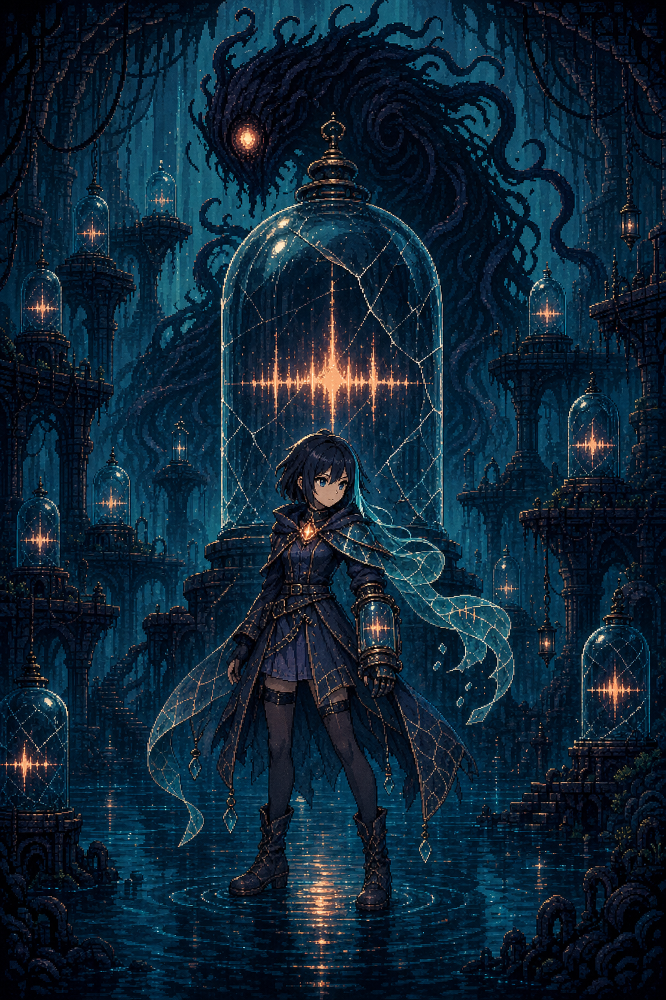

# Voxglass（声匣修复者）



一款 2D 像素动作探索游戏。在被淹没的地下声档案馆中，
修复被「活体寂静」夺走的人类声音。

## 状态

功能面已超 60 秒原型，当前竖切含 Hub、5 档案房、6 能力、
5 存档槽、6 商店条目、15 成就与程序化音频。现代
fresh-import 门禁 11/11 通过，Windows 导出成功，6/6
实机截图通过。仍非 release candidate，完整通关、CI、
签名等未完成。以 [CURRENT_STATUS.md](docs/01-entry/current-status.md)
为权威入口。

## 当前构建契约

- **五房路线：** 新游戏 → archive_01 → Hub →
  archive_02/03/04 → 解锁 archive_05 → 胜利。
- **六种能力：** Pulse、Bind、Cut、Echo、Wave、Whisper。
- **五个存档槽：** user://saves/slot_N.json 保存房间/状态。
- **15 枚成就：** full_archive 等。
- **证据边界：** 现代门禁 11/11 绿，实拍 6/6 绿。

## 技术栈

- 引擎：Godot 4.6.3 fresh import 验证
- 分辨率：480x270 内部，整数倍至 1920x1080
- 语言：GDScript
- 音频：程序化 SFX + 9 BGM (AudioStreamWAV)
- 死亡与重生：1.5s 倒下 + Hub 回归切换
- 档案房二阶段灯光：M12 打磨

## 项目结构

```
assets/        # 美术、音频和设计参考
src/           # 源代码
  autoload/    # GameState、AudioManager
  scenes/      # Godot 场景 (.tscn)
  scripts/     # GDScript 逻辑
docs/          # 分层文档 (见 00-index.md)
scripts/       # Python 素材管线
data/          # JSON 数据
```

## 按键

| 动作 | 键盘 | 手柄 |
|---|---|---|
| 移动 | A/D 或方向键 | 左摇杆 |
| 跳跃 | 空格 或 W | A 键 |
| Pulse | J 或 Z | X 键 |
| Bind | K 或 X | Y 键 |
| Cut | L 或 C | 按钮 4 |
| Echo | Q 或 R | 按钮 5 |
| Wave | V | 按钮 6 |
| Whisper | T 或 4 | 按钮 7 |
| 交互 | E 或 Enter | B 键 |
| 暂停 | ESC | Start 键 |
| 存档 | 存档灯笼 / 暂停 → 保存 | — |
| 读档 | 标题屏 → 继续修复 | — |

## 截图

docs/screenshots/ 中 6 张 1920x1080 PNG 为素材合成
mockup，非实拍。真实捕获 6/6 通过。

## 存档系统

5 槽位持久化到 user://saves/slot_N.json，保存房间、
生命/共鸣、进度、升级、检查点、时间、成就。

## 音频控制

设置 → 音频：Master/Music/SFX/Ambience 四 bus。
持久化到 user://settings.cfg。

## BGM 9 主题色板

| Key | 调性 | BPM | 触发时机 |
|---|---|---|---|
| title_intro | 希望 | 60 | TITLE |
| hub_warm | 温暖 | 88 | 早期 Hub |
| archive_exploration | 忧郁 | 72 | 档案房 |
| archive_boss | 紧张 | 108 | 单 Boss |
| archive_boss_dual | 狂乱 | 132 | 双 Boss |
| archive_dawn | 胜利 | 76 | 胜利终曲 |
| archive_storm | 混沌 | 120 | 阶段 2 |
| whisper_hollow | 静默 | 50 | 后期 Hub |
| silence_void | 空无 | 60 | 失败/终曲 1 |

## 游戏状态机

| 状态 | 触发 | BGM | 备注 |
|---|---|---|---|
| TITLE | 启动 | title_intro | 菜单循环 |
| PLAYING | 新游戏/恢复 | hub_warm 等 | Boss 覆盖 |
| PAUSED | 暂停 | 保持 | BGM 继续 |
| ROOM_TRANSITION | 房门 | 保持 | 0.4s 淡出 |
| GAME_OVER_SUCCESS | 通关 | silence→dawn | 两阶段 |
| GAME_OVER_FAILURE | HP≤0 | silence_void | 冷灰洗 |

## 开发

历史流程见 [ITERATION_GUIDE.md](docs/02-guides/iteration-guide.md)，
约定见 [CONTRIBUTING.md](docs/02-guides/contributing-core.md)。

### 历史 Linux 分卷恢复

godot/ 为历史分卷，非当前二进制。安装 Godot 4.6.3
后显式传入 runner。详见 [godot/README.md](godot/README.md)。

## 开发路线图

Backlog 在 [ROADMAP.md](docs/03-product/roadmap/index.md)，
任务 T001–TNNN。

### 里程碑

| 里程碑 | 状态 | 关键任务 | 备注 |
|---|---|---|---|
| M1 核心循环 | ✅ 历史 | T001–T013 | 60s 可玩 |
| M2 第二敌人 | ✅ 历史 | T017–T025 | NoteWisp |
| M3 存档 | ✅ 历史 | T022 T026 | 存档 |
| M4 玩家进度 | ✅ 历史 | T029–T034 | 共鸣 |
| M5 Hub | ✅ 历史 | T035 T036 | Hub |
| M6 统计 | ✅ 历史 | T041 T059 | 15 成就 |
| M7 BGM | ✅ 历史 | T062 T071 | 9 主题 |
| M8 死亡 | ✅ 历史 | T074 T075 | 死亡 |
| M9 商店 | ✅ 历史 | T069 T072 | 胶囊 |
| M10 截图 | ✅ 历史 | T083 | mockup |
| M11 后期 | ✅ 历史 | T067 T068 | Archive 04 |
| M12 打磨 | ✅ 历史 | T076 | 灯光 |

## 文档导航

- [入口详情](docs/01-entry/details.zh-CN.md) — 详细安装/贡献/手册
- [总导航](docs/00-index.md) — 4 层文档导航
- [Roadmap](docs/03-product/roadmap/index.md) — 迭代区间
- [Changelog](docs/03-product/changelog/index.md) — 50 轮分片
- [当前状态](docs/01-entry/current-status.md) — 权威状态
- [资产登记](docs/03-product/asset-registry.md) — 77 条目

> 最后更新：ITERATION 315 (#315 审查模式)

## 最近更新（近 2 轮）

- #315 审查模式 5 维度 61/61 PASS
- #314 T371 9.6.113 硬度 polish
- 更多见 [Changelog](docs/03-product/changelog/index.md)
  与 [详情](docs/01-entry/details.zh-CN.md)

## 最近完成的工作

## #315 — 审查 #315 5维审计 61/61 通过
审查模式，0 代码改动，文档同步，61 项检查。

## #314 — T371 §9.6.113 硬度 polish 1:1 落地
6 verb 硬度维度，113 分片 0 漂移。

详见 [Changelog](docs/03-product/changelog/index.md)
与 [详情](docs/01-entry/details.zh-CN.md) 完整记录。

## 关联

- 英文版：[README.md](README.md)
- 贡献：[CONTRIBUTING.md](CONTRIBUTING.md)
- 迭代指南：[docs/02-guides/iteration-guide.md](docs/02-guides/iteration-guide.md)

